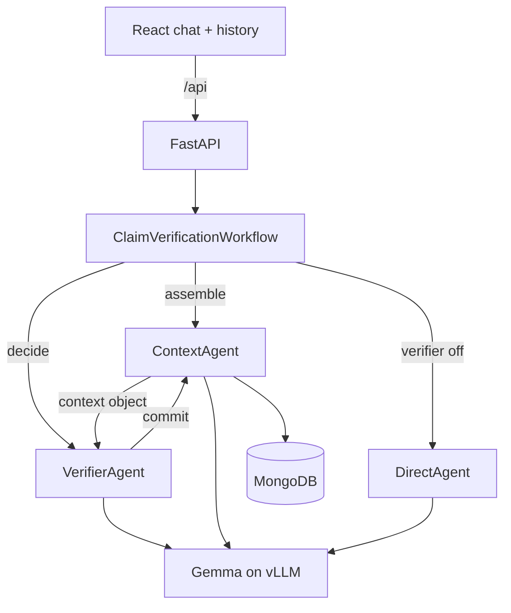

# Claim Verifier

A biological claim-verification chat app built on two cooperating agents. The verifier decomposes
a statement into atomic claims, plans what information would settle them, assesses the claims, and
returns a verdict with an honest confidence level. It does not call an external search or corpus.

## How it works



The verified path has four decision points: `decompose`, `plan`, `assess`, and `verdict`. The
context agent owns the durable context and writes a revision after each decision. The direct path
answers in one model call when the verifier toggle is off.

## Running it

You need Python 3.10+ and Node 20+. MongoDB and the vLLM endpoint are optional because the project
falls back to an in-memory store and deterministic mock inference.

```bash
python3 -m venv .venv
.venv/bin/pip install -r backend/requirements.txt
cp backend/.env.example backend/.env
.venv/bin/python -m uvicorn backend.main:app --reload --port 8000
```

In another shell:

```bash
npm install --prefix frontend
npm run dev --prefix frontend
```

Open `http://localhost:5173`. Configure `VLLM_BASE_URL`, `VLLM_API_KEY`, and MongoDB settings in
`backend/.env` when using live services.

## API

The main endpoints are `GET /api/status`, conversation CRUD under `/api/chats`,
`GET /api/chats/{id}/contexts`, and `POST /api/chats/{id}/messages`. Message bodies use
`{"content": "...", "use_verifier": true}`. The message stream emits `turn_started`, `stage`,
`claims`, `token`, `message`, `error`, and `done` events.

## Tests

```bash
.venv/bin/python -m pytest
```

The suite covers output parsing, context commits, both agent modes, the workflow, and the HTTP API.

## Layout

```text
backend/
  main.py, config.py, dependencies.py   app, settings, and wiring
  db/                                   Mongo store and in-memory fallback
  memory/verifier_memory.md             durable verifier guidance
  models/schemas/                       chat, context, and stage outputs
  routers/                              chat and verification endpoints
  services/agent/                       verifier, context, direct, and inference agents
  services/workflow/                    claim verification workflow
frontend/src/
  features/chat, features/history, features/trace
  hooks/, lib/                          API client and shared types
```
