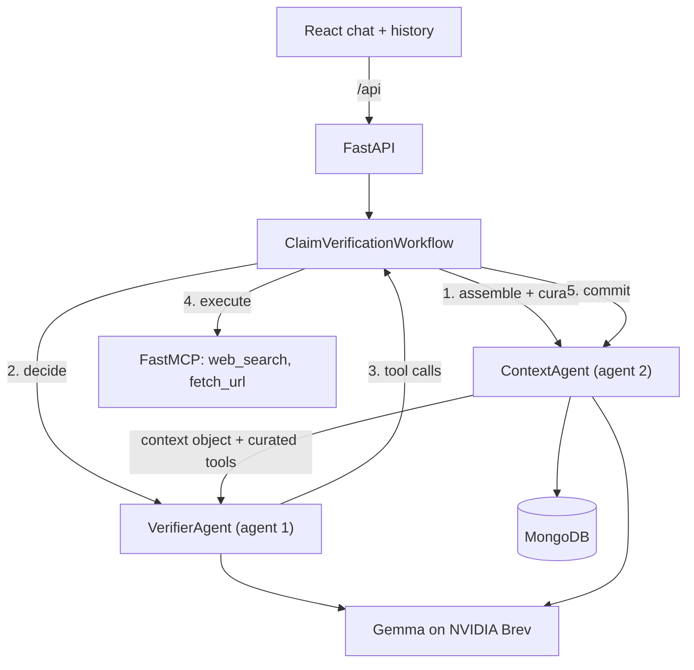

# Claim Verifier

A claim-verification chat app built on two cooperating agents. You paste a statement, and the
system decomposes it into checkable claims, researches them with live web tools over MCP, judges
each claim against what it found, and answers with a verdict and citations.

The point of the project is the context engineering: a second agent owns everything the reasoning
agent sees. It assembles the context object, curates which tools are exposed at each decision
point, and persists a new context revision after every decision.

## How it works



### The five decision points

| Stage | Agent 1 decides | Tools agent 2 exposes |
| --- | --- | --- |
| `decompose` | the atomic claims in the message | none |
| `plan` | what evidence would settle each claim | none |
| `gather` | which searches and pages to fetch | `web_search`, then `fetch_url` |
| `assess` | supported / refuted / insufficient, per claim | none |
| `verdict` | the final answer, label and confidence | none |

The gather stage loops until agent 1 says it has enough or the tool budget runs out.

### The two agents

- **`VerifierAgent`** ([backend/services/agent/verifier_agent.py](backend/services/agent/verifier_agent.py))
  sees exactly three things: the memory file
  ([backend/memory/verifier_memory.md](backend/memory/verifier_memory.md)), the context object, and
  the curated tools. It never talks to the database.
- **`ContextAgent`** ([backend/services/agent/context_agent.py](backend/services/agent/context_agent.py))
  never answers the user. It reads the conversation, `assemble`s the context for a turn,
  `curate`s the tool surface, `commit`s each decision plus any tool output into a new revision,
  and `compact`s the turn into a running summary for the next one.

The first call of a conversation gets an empty context object; from there every call carries what
agent 2 decided to keep.

### Why prompted JSON instead of function calling

Gemma has no dependable native tool-calling, so nothing relies on the OpenAI `tools` field. Each
stage has a Pydantic output model in
[backend/models/schemas/actions.py](backend/models/schemas/actions.py) that Pydantic AI injects
into the prompt as a JSON schema and validates on the way back, re-asking the model when it
misbehaves. Requests carry a single system message, which is what the Gemma chat template accepts.

## Running it

Requirements: Python 3.10+, Node 20+, and optionally MongoDB and a Brev endpoint.

```bash
# backend
python3 -m venv .venv
.venv/bin/pip install -r backend/requirements.txt
cp backend/.env.example backend/.env      # fill in what you have
.venv/bin/python -m uvicorn backend.main:app --reload --port 8000

# frontend (in another shell)
cd frontend
npm install
npm run dev                                # http://localhost:5173, proxies /api to :8000
```

`GET /api/status` reports what is live and what is mocked.

### Nothing configured? It still runs

Each dependency degrades on its own, so the full workflow is demonstrable offline:

| Missing | Behaviour |
| --- | --- |
| `BREV_BASE_URL` | a deterministic mock model answers every stage |
| `SERPAPI_API_KEY` | `web_search` returns placeholder results |
| MongoDB | conversations and contexts live in memory for the process lifetime |
| `MCP_URL` | the MCP server runs in-process instead of over HTTP |

### Running the MCP server separately

By default the tool server is imported in-process. To run it as a real MCP service over
streamable HTTP:

```bash
.venv/bin/python -m backend.services.mcp.server   # listens on :9000/mcp
# then set MCP_URL=http://127.0.0.1:9000/mcp and restart the API
```

## Configuration

All settings live in `backend/.env` (see [backend/.env.example](backend/.env.example)).

| Variable | Purpose |
| --- | --- |
| `BREV_BASE_URL` | OpenAI-compatible base URL of the Gemma deployment, including `/v1` |
| `BREV_API_KEY` | bearer token for that endpoint |
| `BREV_MODEL` | model name to request, e.g. `google/gemma-3-27b-it` |
| `MONGODB_URI`, `MONGODB_DB` | conversation and context storage |
| `SERPAPI_API_KEY` | enables real web search |
| `MCP_URL` | remote MCP server; empty means in-process |
| `MOCK_LLM`, `MOCK_SEARCH` | force mocking even when credentials exist |
| `MAX_GATHER_STEPS` | tool budget per turn |
| `MAX_CLAIMS` | claims extracted per message |

## API

| Method | Path | Purpose |
| --- | --- | --- |
| `GET` | `/api/status` | what is wired up and what is mocked |
| `GET` | `/api/chats` | conversation history for the sidebar |
| `POST` | `/api/chats` | start a conversation |
| `GET` | `/api/chats/{id}` | full conversation with messages, verdicts and traces |
| `PATCH` | `/api/chats/{id}` | rename |
| `DELETE` | `/api/chats/{id}` | delete the conversation and its contexts |
| `GET` | `/api/chats/{id}/contexts` | every context revision agent 2 wrote |
| `POST` | `/api/chats/{id}/messages` | run a turn; SSE by default, `?stream=false` for JSON |

The SSE stream emits `turn_started`, `stage`, `claims`, `tool_call`, `token`, `message`, `error`
and `done` events, which is what drives the live reasoning trail in the UI.

## Tests

```bash
.venv/bin/python -m pytest
```

The suite covers the output-envelope parsing and salvage, agent 2's curation policy and context
commits, a full workflow run over the mock model and the in-process MCP server, and the HTTP API
including the SSE stream. It never touches the network.

## Layout

```
backend/
  main.py, config.py, dependencies.py   app, settings, wiring
  db/                                   Mongo store + in-memory fallback
  memory/verifier_memory.md             durable knowledge for agent 1
  models/schemas/                       chat, context object, stage outputs
  routers/                              chats CRUD, verification stream
  services/agent/                       the two agents, prompts, inference
  services/mcp/                         FastMCP server and client
  services/workflow/                    the five decision points
frontend/src/
  features/chat, features/history, features/trace
  hooks/, lib/                          SSE client and types
```
