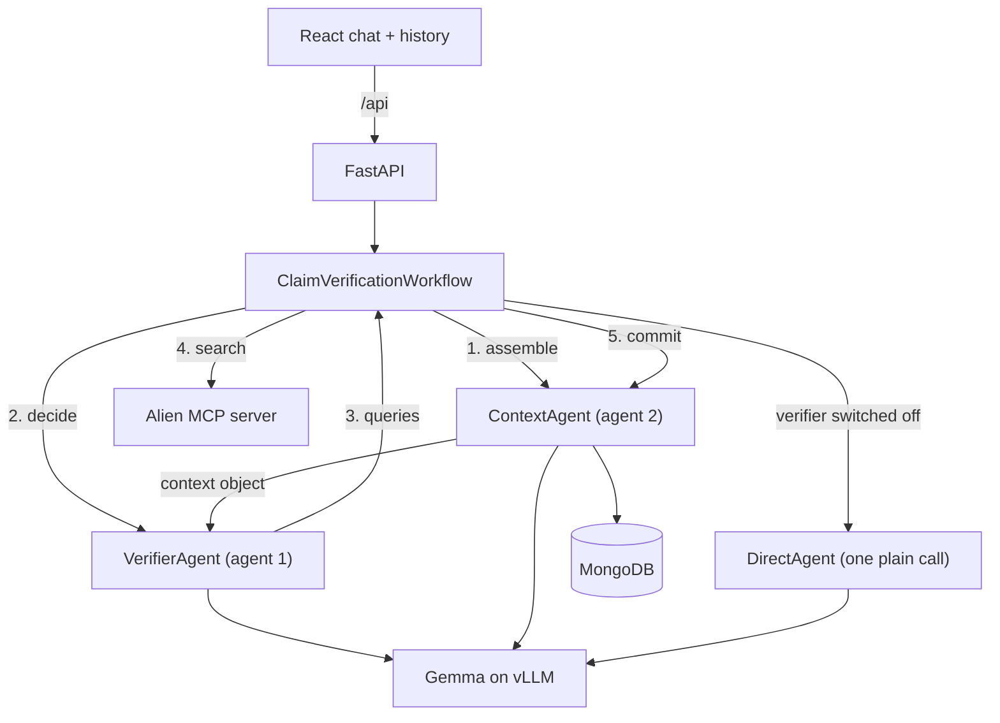

# Claim Verifier

A claim-verification chat app built on two cooperating agents. You paste a statement, and the
system decomposes it into checkable claims, researches them against a document corpus served over
the Alien MCP server, judges each claim against what it found, and answers with a verdict and
citations.

The point of the project is the context engineering: a second agent owns everything the reasoning
agent sees. It assembles the context object and persists a new revision after every decision, and
that is its whole job.

## How it works



### The five decision points

| Stage | Agent 1 decides | Retrieval |
| --- | --- | --- |
| `decompose` | the atomic claims in the message | none |
| `plan` | what evidence would settle each claim | none |
| `gather` | which searches to run against the corpus | one search per query |
| `assess` | supported / refuted / insufficient, per claim | none |
| `verdict` | the final answer, label and confidence | none |

The gather stage loops until agent 1 says it has enough or the search budget runs out.

### The two agents

- **`VerifierAgent`** ([backend/services/agent/verifier_agent.py](backend/services/agent/verifier_agent.py))
  sees exactly two things: the memory file
  ([backend/memory/verifier_memory.md](backend/memory/verifier_memory.md)) and the context object.
  It never talks to the database and never picks a tool — at `gather` it writes queries, and the
  orchestrator runs them.
- **`ContextAgent`** ([backend/services/agent/context_agent.py](backend/services/agent/context_agent.py))
  never answers the user and never judges a claim. It reads the conversation, `assemble`s the
  context for a turn, `commit`s each decision plus the passages its searches returned into a new
  revision, and `compact`s the turn into a running summary for the next one.

The first call of a conversation gets an empty context object; from there every call carries what
agent 2 decided to keep.

### Turning the verifier off

The switch in the chat header sends `use_verifier: false` with the message, and the turn takes a
different path: [`DirectAgent`](backend/services/agent/direct_agent.py) answers in a single call to
the same model, with no context object, no claim decomposition, no retrieval and no verdict. The
answer is still saved to the conversation, so a chat can mix both kinds of turn and the difference
between them is visible side by side — which is the point of having the switch at all.

### Retrieval over MCP

MCP is the transport to one search tool, not a surface the model chooses from.
[`AlienRetriever`](backend/services/retrieval/alien_client.py) connects to the Alien MCP server at
startup, lists the tools it advertises, and picks the one to search with — the highest-ranked
candidate by name, or whatever `ALIEN_MCP_SEARCH_TOOL` pins. Arguments are filled from that tool's
own JSON schema (the query, and a result limit and dataset ids when it accepts them), and whatever
shape it answers with is normalised into passages. Nothing is hardcoded to one deployment.

The corpus this is pointed at is bioRxiv/medRxiv preprints, served from
`https://biorxiv.mcp.alien.club/mcp`, where `datacluster_vector_search_chunks` is the tool that gets
picked. Two details of that server are worth knowing, because both are handled generically:

- **The hits are anonymous.** A chunk comes back as text, a similarity score and the ids of the
  entry and dataset it was cut from — no title, no link. So the retriever reads the dataset
  catalogue once at startup, and asks the entry tool for the paper's name the first time a chunk
  from it shows up (cached per process). That is what turns a passage into something citable.
- **The payload is wrapped.** The reply is a structured object holding a JSON string holding
  `{"success": ..., "data": {"results": [...]}}`, so the list of hits is unwrapped by name rather
  than by position.

### Logging in to the corpus

The public Alien servers sit behind OAuth, so the first connection needs a browser:

```bash
.venv/bin/python -m backend.scripts.alien_login
```

That registers a client, opens the Alien login, caches the tokens under `backend/.oauth`, and then
proves the wiring by running one search and printing the passages it got back. Every later
connection — including the app's own startup — reuses those tokens. Pass a bearer token as
`ALIEN_MCP_TOKEN` instead and the whole flow is skipped.

### Why prompted JSON instead of function calling

Gemma has no dependable native tool-calling, so nothing relies on the OpenAI `tools` field. Each
stage has a Pydantic output model in
[backend/models/schemas/actions.py](backend/models/schemas/actions.py) that Pydantic AI injects
into the prompt as a JSON schema and validates on the way back, re-asking the model when it
misbehaves. Requests carry a single system message, which is what the Gemma chat template accepts.

## Running it

You need Python 3.10+ and Node 20+. Everything else — MongoDB, the vLLM endpoint, the Alien MCP
server — is optional; see [Nothing configured?](#nothing-configured-it-still-runs) below.

Run both commands from the repository root, in two shells:

```bash
# 1. backend  -> http://localhost:8000
python3 -m venv .venv
.venv/bin/pip install -r backend/requirements.txt
cp backend/.env.example backend/.env      # then fill in the credentials you have
.venv/bin/python -m backend.scripts.alien_login   # once: log in to the corpus
.venv/bin/python -m uvicorn backend.main:app --reload --port 8000

# 2. frontend -> http://localhost:5173, proxies /api to :8000
npm install --prefix frontend
npm run dev --prefix frontend
```

Open http://localhost:5173. `GET /api/status` reports what is live and what is mocked.

### Where everything goes

| What | Where it goes |
| --- | --- |
| Python dependencies | declared in `backend/requirements.txt`, installed into `.venv/` at the repository root |
| Node dependencies | declared in `frontend/package.json`, installed into `frontend/node_modules/` |
| Credentials and settings | `backend/.env`, copied from [backend/.env.example](backend/.env.example) — a `.env` at the repository root works too |
| Agent 1's durable knowledge | `backend/memory/verifier_memory.md`, edited by hand |

The backend is imported as the `backend` package, so `uvicorn` has to be started from the
repository root, not from inside `backend/`.

### Nothing configured? It still runs

Each dependency degrades on its own, so the full workflow is demonstrable offline with an empty
`.env`:

| Missing | Behaviour |
| --- | --- |
| `VLLM_BASE_URL` / `BREV_BASE_URL` | a deterministic mock model answers every stage |
| `ALIEN_MCP_URL`, or the login | searches return placeholder passages |
| MongoDB | conversations and contexts live in memory for the process lifetime |

## Deploying to Vercel

The repo is set up as a single Vercel project: Vite builds into `public/`, and FastAPI runs from
[`api/index.py`](api/index.py) as a Python function (up to 300s per turn).

```bash
npx vercel@latest login
npx vercel@latest          # preview
npx vercel@latest --prod   # production
```

Set these in the Vercel project **Environment Variables** (Production + Preview):

| Variable | Notes |
| --- | --- |
| `VLLM_BASE_URL` | e.g. `http://…:8000/v1` — host must be reachable from Vercel's network |
| `VLLM_API_KEY` | inference bearer token |
| `VLLM_MODEL` | usually `google/gemma-3-27b-it` |
| `ALIEN_MCP_URL` | `https://biorxiv.mcp.alien.club/mcp` |
| `ALIEN_MCP_TOKEN` | preferred in production (browser OAuth cannot run on the serverless host) |
| `MOCK_SEARCH` | `true` if you have no Alien token yet |
| `MOCK_LLM` | leave `false` when the vLLM host is up |

CORS already allows `https://*.vercel.app`. For a custom domain, add it to `CORS_ORIGINS`.

If you prefer a split deploy (frontend only on Vercel), set `VITE_API_BASE` to your API origin and
point the Vercel project root at `frontend/`.

An unreachable corpus is logged as a warning at startup rather than being fatal: the five decision
points still run, `gather` just comes back empty-handed.

## Configuration

All settings live in `backend/.env` (see [backend/.env.example](backend/.env.example)).

| Variable | Purpose |
| --- | --- |
| `VLLM_BASE_URL` | OpenAI-compatible base URL of the Gemma deployment, including `/v1` |
| `VLLM_API_KEY` | bearer token for that endpoint |
| `VLLM_MODEL` | model name to request, e.g. `google/gemma-3-27b-it` |
| `BREV_*` | legacy aliases of the `VLLM_*` variables above |
| `MONGODB_URI`, `MONGODB_DB` | conversation and context storage |
| `ALIEN_MCP_URL` | streamable HTTP endpoint of the Alien MCP server |
| `ALIEN_MCP_TOKEN` | bearer token for that server; empty means use the OAuth login |
| `ALIEN_MCP_OAUTH` | run the browser login, caching tokens in `backend/.oauth` |
| `ALIEN_OAUTH_CALLBACK_PORT` | local port the login redirects back to, `8765` by default |
| `ALIEN_MCP_SEARCH_TOOL` | pin the tool to search with; empty means auto-detect |
| `ALIEN_DATASET_IDS` | datasets to scope searches to, when the tool accepts them |
| `ALIEN_SEARCH_LIMIT` | passages requested per search |
| `MOCK_LLM`, `MOCK_SEARCH` | force mocking even when credentials exist |
| `MAX_GATHER_STEPS` | search budget per turn |
| `MAX_CLAIMS` | claims extracted per message |

## API

| Method | Path | Purpose |
| --- | --- | --- |
| `GET` | `/api/status` | what is wired up and what is mocked |
| `GET` | `/api/chats` | conversation history for the sidebar |
| `POST` | `/api/chats` | start a conversation |
| `GET` | `/api/chats/{id}` | full conversation with messages, verdicts and traces |
| `PATCH` | `/api/chats/{id}` | rename |
| `DELETE` | `/api/chats/{id}` | delete the conversation and its contexts |
| `GET` | `/api/chats/{id}/contexts` | every context revision agent 2 wrote |
| `POST` | `/api/chats/{id}/messages` | run a turn; SSE by default, `?stream=false` for JSON |

The message body is `{"content": "...", "use_verifier": true}`; `use_verifier: false` runs the
direct path instead.

The SSE stream emits `turn_started`, `stage`, `claims`, `retrieval`, `token`, `message`, `error`
and `done` events, which is what drives the live reasoning trail in the UI. `turn_started` carries
the `mode` the turn ran in, and a direct turn emits only `turn_started`, `token`, `message` and
`done`.

## Tests

```bash
.venv/bin/python -m pytest
```

The suite covers the output-envelope parsing and salvage, agent 2's context commits, tool
discovery and result normalisation against an in-process MCP server, a full workflow run over the
mock model in both modes, and the HTTP API including the SSE stream. It never touches the network.

## Layout

```
backend/
  main.py, config.py, dependencies.py   app, settings, wiring
  db/                                   Mongo store + in-memory fallback
  memory/verifier_memory.md             durable knowledge for agent 1
  models/schemas/                       chat, context object, stage outputs
  routers/                              chats CRUD, verification stream
  scripts/alien_login.py                one-off browser login to the corpus
  services/agent/                       the two agents, the direct baseline, prompts, inference
  services/retrieval/                   the Alien MCP client
  services/workflow/                    the five decision points
frontend/src/
  features/chat, features/history, features/trace
  hooks/, lib/                          SSE client and types
```
